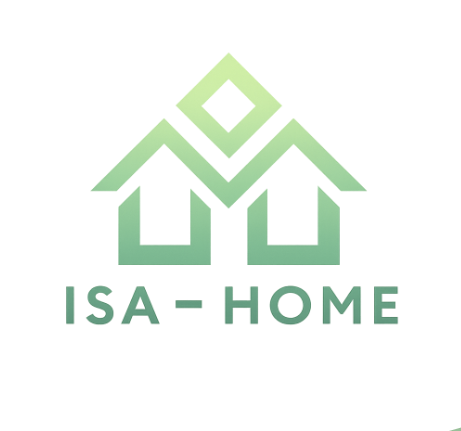

# ISA-Home (Intelligent Smart Assistant for Home)

<p align="center">
  
</p>

**Proyecto EIA 2025/2026 – Universidad Complutense de Madrid**  
Asistente doméstico inteligente basado en inteligencia artificial y robótica, diseñado para integrarse en el hogar y ayudar en las tareas cotidianas con eficiencia, autonomía y seguridad.

---

## Descripción general

**ISA-Home** es un robot humanoide multifuncional conectado al ecosistema inteligente del hogar.  
Su objetivo es mejorar la calidad de vida de las personas mediante la automatización de tareas diarias como la limpieza, la gestión del consumo energético o la asistencia a personas con movilidad reducida.  

<p align="center">
  
</p>

El proyecto combina **software de control**, **modelos de inteligencia artificial**, **diseños de hardware** y una **aplicación móvil**, integrando todos los componentes en una solución colaborativa y escalable.

---

## Características principales

- **Interfaz inteligente:** permite comunicarse mediante voz o aplicación móvil.  
- **Planificación autónoma:** el sistema adapta sus tareas al entorno y a las rutinas del usuario.  
- **Ecosistema conectado:** integración con dispositivos IoT y asistentes de voz (Alexa, Google Home…).  
- **Software modular:** arquitectura dividida en módulos (percepción, planificación, control, interacción).  
- **IA local y en la nube:** el robot combina procesamiento local con servicios en la nube para optimizar rendimiento y privacidad.  

---

## Estructura del repositorio

```
ISA-HOME/
├── Sprint 0/ # Documentación inicial y planificación del proyecto
├── Sprint 1/ # Avances técnicos y presentaciones parciales
├── Sprint 2/ # Diseño de marca, naming y documentación visual
├── LICENSE # Archivo con las licencias aplicables a cada componente
└── README.md # Descripción general del proyecto
```


---

## Equipo de desarrollo

- **Pablo Alonso Romero** - Scrum Master
- **Marina Triviño de las Heras (maritriv)** – Team Advocate
- **Álvaro Ferreño Iglesias** - GitHub Expert
- **Mario López Díaz** - Product Owner

Proyecto desarrollado en el marco de la asignatura **Ética e Inteligencia Artificial**.

---

## Licencia

El **software principal** del proyecto se distribuye bajo licencia **propietaria (All Rights Reserved)**.  
Algunos componentes, como librerías auxiliares o datasets, emplean licencias abiertas (Apache 2.0, CC-BY-SA, CERN-OHL-W).  

Más información en el archivo [`LICENSE`](./LICENSE).


---

> ISA-Home — Asistente doméstico inteligente al servicio del bienestar humano.
